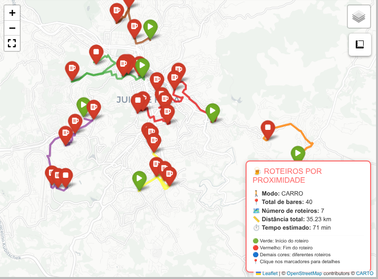

# Roteirização geoespacial: diferentes abordagens

### Introdução

Sobre o mesmo tema, publicamos um [artigo](https://github.com/guiajf/roteiro-butecos) em que discorremos sobre o desenvolvimento de roteiros simplificados, calculados de acordo com a fórmula de *Haversine*, em linha reta, com técnicas apropriadas para a realização de agrupamentos baseados em proximidade geográfica e otimização baseada na variante aberta do *Problema do Caixeiro Viajante*.

Nos próximos três artigos da série, a que damos início, intentamos que as rotas obedeçam à geometria das ruas, seguindo exatamente o traçado das vias. Para isso, exploramos inicialmente, as funcionalidades do pacote **Osmnx** em conjunto com **NetworkX** , depois a **API** do **OpenRouteService(ORS)** e finalmente a solução de roteamento **Open Source Routing Machine(OSRM)**.

As vantagens do **Osmnx** são:  integração nativa com o **NetworkX** para análise de grafos, não exige chave **API**, oferece quantidade ilimitada de requisições, possui precisão muito alta e fornece os modos de percurso *walk*, *drive* e *bike*. Além disso, com o **Osmnx** você baixa o grafo uma vez por *cluster* e reutiliza para todos os cálculos de distância e rotas, tornando o processo mais eficiente.

Entretanto, o **Osmnx** é realmente pesado para máquinas com recursos limitados,  porque ele baixa e processa grafos inteiros de ruas (milhares de *nós* e *arestas*) na memória.

Para superar esse desafio, recomenda-se o uso do **OSRM**, que é muito mais leve porque não baixa o grafo completo, faz requisições pontuais à **API** e o processamento é feito no servidor. Entretanto, por se tratar de uma infraestrutura pública, o usuário tem que conviver com limitações de disponibilidade e sobrecarga  nos horários de pico.

A solução intermediária integra o uso do **ORS**, que utiliza rotas reais baseadas na infraestrutura viária do *OpenStreetMap*. A principal vantagem do **ORS** é a qualidade dos dados e a riqueza dos metadados fornecidos, incluindo geometria detalhada das rotas, altitudes e instruções passo a passo. Contudo, exige a obtenção de chave de **API**, impoẽ limites diários de requisições para contas gratuitas e uma política de segurança que exige cabeçalhos HTTP específicos.

Nos próximos artigos, analisaremos detalhadamente cada uma dessas três abordagens, a começar pelo **OSMnx** em conjunto com o **NetworkX**, depois avançamos para a solução intermediária com o **ORS** e concluímos com a abordagem mais leve baseada no **OSRM**.

### Apresentação

A primeira abordagem adota o **OSMnx** em conjunto com o **NetworkX** para construir uma solução de roteirização autônoma, capaz de operar offline após o download inicial dos dados viários. Nesta arquitetura, as duas bibliotecas desempenham papéis complementares, mas distintos.

O **OSMnx** é responsável pela interface com o *OpenStreetMap* e pela construção do grafo viário. Ele baixa a geometria das ruas de uma região (definida por um ponto central e um raio) e a converte em um objeto de *grafo* que o **NetworkX** pode processar. Além disso, o **OSMnx** oferece utilitários para simplificar a topologia das ruas, projetar o grafo para coordenadas métricas e encontrar os *nós* mais próximos a determinadas coordenadas geográficas (função *nearest_nodes*). Em outras palavras, o **OSMnx** atua como a camada de extração, preparação e indexação dos dados geoespaciais, transformando informações brutas do mapa em uma estrutura de grafo pronta para análise.

O **NetworkX**, por sua vez, é a biblioteca que implementa os algoritmos de teoria dos grafos propriamente ditos. Uma vez que o *grafo* é carregado na memória pelo **OSMnx**, o **NetworkX** assume o controle de todas as operações de consulta e otimização. É ele que calcula a distância real entre dois pontos através da função *nx.shortest_path_length(G, node1, node2, weight='length')*, percorrendo o *grafo* e somando os pesos das *arestas* (que representam os comprimentos dos segmentos de rua). Da mesma forma, o **NetworkX** é responsável por extrair o caminho completo (a sequência de *nós*) que conecta dois bares através da função *nx.shortest_path(G, node1, node2, weight='length')*, informação essencial para desenhar a rota real sobre o mapa. O **NetworkX** também poderia ser utilizado para análises mais avançadas, como identificar a centralidade de determinados nós ou calcular componentes conectados, de acordo com exemplos que fornecemos [aqui](https://github.com/guiajf/cb_network), ainda que no contexto do roteirizador tenhamos nos limitado às funcionalidades básicas de caminho mínimo.


### Bibliotecas

Carregamos as seguintes bibliotecas:

- **pandas**: biblioteca fundamental para análise de dados em Python,
oferece estruturas como DataFrame e Series para manipulação e
análise de dados tabulares. Neste projeto, é utilizada para
carregar e inspecionar a lista dos 40 bares participantes.

- **numpy**: pacote essencial para computação científica, fornece
suporte a arrays multidimensionais e funções matemáticas de
alto desempenho. Utilizado para converter coordenadas e gerenciar
a matriz de distâncias.

- **osmnx**: biblioteca especializada para modelagem de redes urbanas
a partir de dados do OpenStreetMap. Permite baixar grafos viários
reais e calcular rotas. Utilizada para obter a rede de ruas de
Juiz de Fora (raio de 30 km) e calcular caminhos mais curtos.

- **networkx**: biblioteca robusta para criação e análise de grafos.
Fornece implementações de algoritmos como Dijkstra e shortest path.
Empregada indiretamente pelo OSMnx para navegação no grafo viário.

- **folium**: biblioteca para visualização geoespacial interativa,
baseada em *Leaflet.js*. Plugins *Fullscreen* e *MeasureControl*
adicionam tela cheia e ferramenta de medição ao mapa.

- **sklearn.neighbors**: módulo especializado em busca por vizinhos
próximos. Implementa algoritmo *ball_tree* para consultas eficientes.
Utilizado para:
    a) agrupar bares em clusters por proximidade geográfica
    b) implementar a heurística gulosa do *vizinho mais próximo*,
       resolvendo o **TSP** aberto dentro de cada cluster.

- **warnings**: módulo da biblioteca padrão para controle de mensagens
de aviso. Utilizado para suprimir alertas técnicos e manter a
saída limpa e focada nos resultados.


```python
import pandas as pd
import numpy as np
import osmnx as ox
import networkx as nx
import folium
from sklearn.cluster import KMeans
from sklearn.neighbors import NearestNeighbors
from folium.plugins import MeasureControl, Fullscreen
import warnings
warnings.filterwarnings('ignore')

```

### Carregamos e inspecionamos os dados

**Carregamos o dataset**


```python
gdf = pd.read_csv("lista_bares.csv")
X = np.array(gdf[['latitude', 'longitude']])
```

**Inspecionamos os dados**


```python
print("=== Informações do dataset ===\n")
gdf.info()

print("\n=== Primeiras 5 coordenadas (lat, lon) ===\n")
print(X[:5])

print(f"\nTotal de bares carregados: {len(gdf)}")
print(f"Colunas disponíveis: {list(gdf.columns)}")
```

    === Informações do dataset ===
    
    <class 'pandas.DataFrame'>
    RangeIndex: 40 entries, 0 to 39
    Data columns (total 9 columns):
     #   Column         Non-Null Count  Dtype  
    ---  ------         --------------  -----  
     0   Name           40 non-null     str    
     1   longitude      40 non-null     float64
     2   latitude       40 non-null     float64
     3   Endereço       40 non-null     str    
     4   Petisco        40 non-null     str    
     5   Contato        40 non-null     str    
     6   Instagram      40 non-null     str    
     7   Descrição      40 non-null     str    
     8   Funcionamento  40 non-null     str    
    dtypes: float64(2), str(7)
    memory usage: 2.9 KB
    
    === Primeiras 5 coordenadas (lat, lon) ===
    
    [[-21.7819995 -43.2989666]
     [-21.7365987 -43.3609957]
     [-21.7586111 -43.3472222]
     [-21.766567  -43.3723106]
     [-21.7756168 -43.378489 ]]
    
    Total de bares carregados: 40
    Colunas disponíveis: ['Name', 'longitude', 'latitude', 'Endereço', 'Petisco', 'Contato', 'Instagram', 'Descrição', 'Funcionamento']


### Definimos o roteiro mais curto

Conforme detalhamos no [artigo anterior sobre o Percurso do Comida di Buteco](https://github.com/guiajf/percurso), a tarefa de encontrar a rota mais curta que visita todos os pontos de interesse (neste caso, os 40 bares) exatamente uma vez corresponde à variante aberta do **Problema do Caixeiro Viajante (TSP)** , equivalente à busca por um *caminho hamiltoniano* de custo mínimo.

Naquele artigo, explicamos que o TSP é classificado como **NP-difícil**, o que significa que não há algoritmo conhecido capaz de encontrar a solução exata em tempo polinomial para um grande número de cidades. Para se ter uma ideia, avaliar todas as rotas possíveis para 40 pontos exigiria testar aproximadamente $\(8 \times 10^{45}\)$ combinações — um número tão astronômico que mesmo os computadores mais rápidos levariam um tempo incomensurável para completar a tarefa.

É precisamente por essa inviabilidade computacional que se justifica o uso de heurísticas, que sacrificam a garantia de otimalidade em favor da eficiência prática.

Seguindo a mesma estratégia adotada anteriormente, empregamos aqui a **heurística gulosa do vizinho mais próximo**, implementada por meio da classe `NearestNeighbors` do módulo `sklearn.neighbors` com o algoritmo `ball_tree`. Um ponto de partida (Ponto 0 - ADEGA BAR) foi definido, e o algoritmo constrói a rota adicionando sequencialmente o vizinho mais próximo ainda não visitado.

A saída abaixo mostra a sequência de bares gerada por essa heurística, que servirá de base para as etapas seguintes de clusterização e mapeamento:

```python
# Calcular a distância para cada par de pontos consecutivos

bares = gdf['Name']
nbrs = NearestNeighbors(n_neighbors=len(X), algorithm='ball_tree').fit(X)
distances, indices = nbrs.kneighbors(X)

# Encontrar o roteiro mais curto
visited = np.zeros(len(X), dtype=bool)

end_point = 5  # Definindo o ponto final como 13 (Casa d'Itália)

visited[0] = True
tour = [0]
current = 0

# Modificado para parar quando chegar ao ponto 39
while current != end_point and len(tour) < len(X):
    unvisited_mask = np.logical_not(visited[indices[current]])
    if np.any(unvisited_mask):
        nearest = indices[current][unvisited_mask][0].item()
    else:
        # Se todos os vizinhos foram visitados, escolha o próximo não visitado
        unvisited = np.where(visited == False)[0]
        if len(unvisited) > 0:
            nearest = unvisited[0]
        else:
            break
    
    tour.append(nearest)
    visited[nearest] = True
    current = nearest

    # Se chegou ao ponto final, pare
    if current == end_point:
        break

# Resultado
print("Rota mais curta terminando no item 5:")
for i, point in enumerate(tour):
    print(f"{i}. {bares[point]} (Ponto {point})")

```

    Rota mais curta terminando no item 5:
    0. ADEGA BAR (Ponto 0)
    1. RECANTO DOS MANACAS (Ponto 35)
    2. EMPORIO DO SABOR (Ponto 26)
    3. VARANDA RESTO BEER (Ponto 38)
    4. PAPPADOG BAR (Ponto 33)
    5. CAMINHO DA ROCA (Ponto 19)
    6. BAR DO ABILIO (Ponto 2)
    7. SUPER LAZIN (Ponto 37)
    8. CASARAO BAR (Ponto 21)
    9. BAR BATATA D'MOLA (Ponto 14)
    10. BAR DO MARQUIM (Ponto 7)
    11. REZA FORTE (Ponto 36)
    12. INFORMAL BAR & RESTAURANTE (Ponto 29)
    13. BIROSCA BAR E RESTAURANTE (Ponto 15)
    14. BAR DO PASSARINHO (Ponto 8)
    15. ZAKAS GASTRO BEER (Ponto 39)
    16. BAR DO ANTONIO (Ponto 3)
    17. BAR DO JORGE (Ponto 6)
    18. BUTECO DO PRINCIPE (Ponto 17)
    19. BAR DO BENE (Ponto 4)
    20. PETISQUEIRA (Ponto 34)
    21. DON JUAN GASTRONOMIA E EVENTOS (Ponto 25)
    22. BAR DO TIAO (Ponto 9)
    23. BAR TORRESMO (Ponto 10)
    24. IBITIBAR (Ponto 28)
    25. BAR SANTA MODERACAO (Ponto 13)
    26. PAO MOIADO BAR (Ponto 32)
    27. DIRCEUS PUB (Ponto 24)
    28. ESPETINHO DA VILLA (Ponto 27)
    29. BUTIQUIM DA FABRICA (Ponto 18)
    30. BAR DU CHICO (Ponto 12)
    31. CARLOTA (Ponto 20)
    32. BAR DU BUNECO (Ponto 11)
    33. LERO LERO (Ponto 30)
    34. BAR DIAS (Ponto 1)
    35. BUDEGA DO PAPAI (Ponto 16)
    36. COMPADRE GRILL COSTELARIA (Ponto 23)
    37. NOSSO BAR JF (Ponto 31)
    38. COLISEUM BAR (Ponto 22)
    39. BAR DO BREJO (Ponto 5)


**Criamos o dicionário das coordenadas**


```python
# Versão concisa usando dict comprehension
coordenadas_referencia = {row['Name']: (row['latitude'], row['longitude']) 
                          for idx, row in gdf.iterrows()}

# Nomes dos locais na ordem original
bares = gdf['Name'].tolist()  

# Ordenar o dicionário conforme a rota
coordenadas_ordenadas = {
    bares[i]: coordenadas_referencia[bares[i]] 
    for i in tour
}

print(coordenadas_ordenadas)
```

    {'ADEGA BAR': (-21.7819995, -43.2989666), 'RECANTO DOS MANACAS': (-21.7739006, -43.309326), 'EMPORIO DO SABOR': (-21.7683638, -43.3281789), 'VARANDA RESTO BEER': (-21.7687003, -43.3436456), 'PAPPADOG BAR': (-21.764711, -43.3445232), 'CAMINHO DA ROCA': (-21.7632591, -43.3454451), 'BAR DO ABILIO': (-21.7586111, -43.3472222), 'SUPER LAZIN': (-21.757916, -43.341287), 'CASARAO BAR': (-21.7554517, -43.3399353), "BAR BATATA D'MOLA": (-21.7541569, -43.3521957), 'BAR DO MARQUIM': (-21.7534911, -43.3533205), 'REZA FORTE': (-21.752821, -43.357038), 'INFORMAL BAR & RESTAURANTE': (-21.752784, -43.358278), 'BIROSCA BAR E RESTAURANTE': (-21.7536439, -43.3586749), 'BAR DO PASSARINHO': (-21.7498068, -43.3680499), 'ZAKAS GASTRO BEER': (-21.755112, -43.37624), 'BAR DO ANTONIO': (-21.766567, -43.3723106), 'BAR DO JORGE': (-21.7672931, -43.3688659), 'BUTECO DO PRINCIPE': (-21.7717784, -43.3752646), 'BAR DO BENE': (-21.7756168, -43.378489), 'PETISQUEIRA': (-21.7889633, -43.3784154), 'DON JUAN GASTRONOMIA E EVENTOS': (-21.789056, -43.3810512), 'BAR DO TIAO': (-21.7882238, -43.3831797), 'BAR TORRESMO': (-21.78997, -43.3533213), 'IBITIBAR': (-21.7854816, -43.347486), 'BAR SANTA MODERACAO': (-21.7867333, -43.34463), 'PAO MOIADO BAR': (-21.7885709, -43.3428745), 'DIRCEUS PUB': (-21.7777764, -43.3483018), 'ESPETINHO DA VILLA': (-21.7753465, -43.3491994), 'BUTIQUIM DA FABRICA': (-21.7745557, -43.3501901), 'BAR DU CHICO': (-21.7652098, -43.3536869), 'CARLOTA': (-21.764565, -43.3521346), 'BAR DU BUNECO': (-21.7418419, -43.3494793), 'LERO LERO': (-21.7416711, -43.3549644), 'BAR DIAS': (-21.7365987, -43.3609957), 'BUDEGA DO PAPAI': (-21.7319617, -43.3568702), 'COMPADRE GRILL COSTELARIA': (-21.7216065, -43.3546633), 'NOSSO BAR JF': (-21.6900456, -43.4338592), 'COLISEUM BAR': (-21.6885565, -43.4341042), 'BAR DO BREJO': (-21.6853665, -43.4362092)}


### Definimos os parâmetros 


```python
# Modo de transporte: 'walk' (pedestre) ou 'drive' (carro)
MODO_TRANSPORTE = 'drive'  # Altere para 'drive' se quiser rotas de carro

# Distância máxima para baixar o grafo (em metros)
# Aumente se os bares estiverem mais distantes
DISTANCIA_GRAFO = 30000  # 2km ao redor do centro

# Número de roteiros (clusters)
NUMERO_ROTEIROS = 7

print(f"\n⚙️ Configurações:")
print(f"   Modo de transporte: {MODO_TRANSPORTE.upper()}")
print(f"   Raio do grafo: {DISTANCIA_GRAFO} m")
print(f"   Número de roteiros: {NUMERO_ROTEIROS}")

```

    
    ⚙️ Configurações:
       Modo de transporte: DRIVE
       Raio do grafo: 30000 m
       Número de roteiros: 7


### Definimos a função para *clustering*


```python
def clusterizar_bares(coordenadas, n_clusters=4):
    """
    Agrupa os bares em clusters baseado na proximidade geográfica
    """
    nomes = list(coordenadas.keys())
    coords = np.array(list(coordenadas.values()))
    
    kmeans = KMeans(n_clusters=n_clusters, random_state=42, n_init=10)
    labels = kmeans.fit_predict(coords)
    
    clusters = {}
    for i, nome in enumerate(nomes):
        cluster_id = labels[i]
        if cluster_id not in clusters:
            clusters[cluster_id] = {}
        clusters[cluster_id][nome] = tuple(coords[i])
    
    return clusters

```

### Definimos a função para extrair o grafo das ruas


```python
def obter_grafo_cluster(bares_cluster, modo='walk'):
    """
    Obtém o grafo de ruas para um cluster de bares
    """
    # Calcular centro do cluster
    coords = list(bares_cluster.values())
    center_lat = np.mean([c[0] for c in coords])
    center_lon = np.mean([c[1] for c in coords])
    
    # Definir network_type baseado no modo
    network_type = 'walk' if modo == 'walk' else 'drive'
    
    try:
        # Baixar grafo ao redor do centro
        G = ox.graph_from_point(
            (center_lat, center_lon), 
            dist=DISTANCIA_GRAFO, 
            network_type=network_type,
            simplify=True
        )
        print(f"      Grafo baixado: {len(G.nodes)} nós, {len(G.edges)} arestas")
        return G
    except Exception as e:
        print(f"      ⚠️ Erro ao baixar grafo: {e}")
        return None

```

### Definimos funções para cálculo de distâncias


```python
def calcular_distancias_reais(bares_cluster, G):
    """
    Calcula matriz de distâncias reais usando o grafo OSMnx
    """
    if G is None:
        # Fallback para Haversine
        print("Usando Haversine (fallback)")
        return calcular_distancias_haversine(bares_cluster)
    
    nomes = list(bares_cluster.keys())
    coords = list(bares_cluster.values())
    n = len(coords)
    
    # Encontrar nós mais próximos para cada bar
    nodes = []
    for lat, lon in coords:
        try:
            node = ox.distance.nearest_nodes(G, lon, lat)
            nodes.append(node)
        except:
            nodes.append(None)
    
    # Calcular matriz de distâncias
    dist_matrix = np.zeros((n, n))
    
    for i in range(n):
        for j in range(i+1, n):
            if nodes[i] is not None and nodes[j] is not None:
                try:
                    # Distância real no grafo
                    dist = nx.shortest_path_length(G, nodes[i], nodes[j], weight='length')
                    dist_matrix[i, j] = dist
                    dist_matrix[j, i] = dist
                except:
                    # Fallback para Haversine
                    lat1, lon1 = coords[i]
                    lat2, lon2 = coords[j]
                    dist = haversine_distance(lat1, lon1, lat2, lon2)
                    dist_matrix[i, j] = dist
                    dist_matrix[j, i] = dist
            else:
                lat1, lon1 = coords[i]
                lat2, lon2 = coords[j]
                dist = haversine_distance(lat1, lon1, lat2, lon2)
                dist_matrix[i, j] = dist
                dist_matrix[j, i] = dist
    
    return dist_matrix

def calcular_distancias_haversine(bares_cluster):
    """
    Calcula matriz de distâncias Haversine (fallback)
    """
    coords = list(bares_cluster.values())
    n = len(coords)
    dist_matrix = np.zeros((n, n))
    
    for i in range(n):
        for j in range(i+1, n):
            lat1, lon1 = coords[i]
            lat2, lon2 = coords[j]
            dist = haversine_distance(lat1, lon1, lat2, lon2)
            dist_matrix[i, j] = dist
            dist_matrix[j, i] = dist
    
    return dist_matrix

```

### Definimos a função para extrair a geometria da rota


```python
def obter_geometria_rota(bares_cluster, rota_indices, G):
    """
    Obtém a geometria completa da rota para visualização
    """
    if G is None:
        return []
    
    nomes = list(bares_cluster.keys())
    coords = list(bares_cluster.values())
    
    # Encontrar nós
    nodes = []
    for lat, lon in coords:
        try:
            node = ox.distance.nearest_nodes(G, lon, lat)
            nodes.append(node)
        except:
            nodes.append(None)
    
    geometrias = []
    for k in range(len(rota_indices)-1):
        i = rota_indices[k]
        j = rota_indices[k+1]
        
        if nodes[i] is not None and nodes[j] is not None:
            try:
                # Obter caminho mais curto
                path = nx.shortest_path(G, nodes[i], nodes[j], weight='length')
                # Converter para coordenadas
                coords_path = [(G.nodes[n]['y'], G.nodes[n]['x']) for n in path]
                geometrias.append(coords_path)
            except:
                # Fallback: linha reta
                lat1, lon1 = coords[i]
                lat2, lon2 = coords[j]
                geometrias.append([[lat1, lon1], [lat2, lon2]])
        else:
            lat1, lon1 = coords[i]
            lat2, lon2 = coords[j]
            geometrias.append([[lat1, lon1], [lat2, lon2]])
    
    return geometrias

```

### Definimos a função para otimizar as rotas


```python
def otimizar_rota_cluster(bares_cluster, G):
    """
    Otimiza rota dentro de um cluster usando TSP
    """
    n = len(bares_cluster)
    
    if n <= 1:
        nomes = list(bares_cluster.keys())
        return nomes, 0.0, []
    
    # Calcular matriz de distâncias reais
    dist_matrix = calcular_distancias_reais(bares_cluster, G)
    
    # TSP guloso
    visitados = [0]
    atual = 0
    distancia_total = 0.0
    
    while len(visitados) < n:
        melhor_dist = float('inf')
        melhor_idx = -1
        
        for j in range(n):
            if j not in visitados:
                if dist_matrix[atual, j] < melhor_dist:
                    melhor_dist = dist_matrix[atual, j]
                    melhor_idx = j
        
        if melhor_idx != -1:
            distancia_total += melhor_dist
            visitados.append(melhor_idx)
            atual = melhor_idx
        else:
            break
    
    # Obter geometria da rota
    geometrias = obter_geometria_rota(bares_cluster, visitados, G)
    
    # Converter para nomes
    nomes = list(bares_cluster.keys())
    rota_ordenada = [nomes[i] for i in visitados]
    
    return rota_ordenada, distancia_total, geometrias

```

### Definimos a função para criar o mapa


```python
def criar_mapa_clusters(todos_clusters, rotas, distancias, geometrias, modo):
    """
    Cria mapa com múltiplos clusters e rotas reais
    """
    cores = {
        0: '#e41a1c',  # vermelho
        1: '#377eb8',  # azul
        2: '#4daf4a',  # verde
        3: '#984ea3',  # roxo
        4: '#ff7f00',  # laranja
        5: '#ffff33',  # amarelo
        6: '#a65628',  # marrom
        7: '#f781bf',  # rosa
    }
    
    # Calcular centro do mapa
    todas_coords = []
    for cluster in todos_clusters.values():
        for coord in cluster.values():
            todas_coords.append(coord)
    todas_coords = np.array(todas_coords)
    center_lat = todas_coords[:, 0].mean()
    center_lon = todas_coords[:, 1].mean()
    
    # Criar mapa base
    mapa = folium.Map(location=[center_lat, center_lon], zoom_start=14, tiles='CartoDB positron')
    folium.TileLayer('CartoDB dark_matter', name='Mapa Escuro', show=False).add_to(mapa)
    
    for cluster_id, bares in todos_clusters.items():
        cor = cores.get(cluster_id, '#999999')
        rota_nomes = rotas.get(cluster_id, [])
        rota_geometrias = geometrias.get(cluster_id, [])
        distancia = distancias.get(cluster_id, 0)
        
        fg = folium.FeatureGroup(name=f'Roteiro {cluster_id + 1} - {len(bares)} bares')
        
        # Adicionar rotas (seguindo ruas reais)
        for geom in rota_geometrias:
            if geom and len(geom) > 1:
                folium.PolyLine(
                    geom,
                    color=cor,
                    weight=4,
                    opacity=0.8,
                    popup=f'Trecho do Roteiro {cluster_id + 1}'
                ).add_to(fg)
        
        # Adicionar marcadores
        for idx, nome in enumerate(rota_nomes):
            coord = bares[nome]
            
            if idx == 0:
                cor_marcador = 'green'
                icone = 'play'
                tooltip = f"🏁 INÍCIO: {nome}"
            elif idx == len(rota_nomes) - 1:
                cor_marcador = 'red'
                icone = 'stop'
                tooltip = f"🏁 FIM: {nome}"
            else:
                cor_marcador = cores.get(cluster_id, 'blue')
                icone = 'beer'
                tooltip = nome
            
            popup_text = f"""
            <div style="font-family: Arial; width: 220px;">
                <b>{nome}</b><br>
                📍 Parada {idx + 1} de {len(rota_nomes)}<br>
                🍺 Roteiro {cluster_id + 1}<br>
            </div>
            """
            
            if idx == 0:
                popup_text = f"""
                <div style="font-family: Arial; width: 220px;">
                    <b>{nome}</b><br>
                    📍 Parada {idx + 1} de {len(rota_nomes)}<br>
                    🍺 Roteiro {cluster_id + 1}<br>
                    📏 Distância total: {distancia/1000:.2f} km<br>
                    🚶 Modo: {modo.upper()}
                </div>
                """
            
            folium.Marker(
                coord,
                popup=folium.Popup(popup_text, max_width=300),
                icon=folium.Icon(color=cor_marcador, icon=icone, prefix='fa'),
                tooltip=tooltip
            ).add_to(fg)
        
        fg.add_to(mapa)
    
    # Adicionar controles
    folium.LayerControl().add_to(mapa)
    MeasureControl().add_to(mapa)
    Fullscreen().add_to(mapa)
    
    # Estatísticas totais
    total_bares = sum(len(c) for c in todos_clusters.values())
    total_distancia = sum(distancias.values())
    tempo_estimado = total_distancia / (1.4 if modo == 'walk' else 8.3) / 60
    
    # Legenda
    legenda_html = f'''
    <div style="position: fixed; bottom: 10px; right: 10px; z-index: 1000;
                background-color: white; padding: 12px; border-radius: 8px;
                border: 2px solid #ff6b6b; font-family: 'Segoe UI', Arial, sans-serif;
                font-size: 12px; box-shadow: 0 2px 10px rgba(0,0,0,0.2);
                max-width: 250px;">
        <h4 style="margin:0 0 8px 0; color:#ff6b6b;">🍺 ROTEIROS POR PROXIMIDADE</h4>
        <b>🚶 Modo:</b> {'PEDESTRE' if modo == 'walk' else 'CARRO'}<br>
        <b>📍 Total de bares:</b> {total_bares}<br>
        <b>🗺️ Número de roteiros:</b> {len(todos_clusters)}<br>
        <b>📏 Distância total:</b> {total_distancia/1000:.2f} km<br>
        <b>⏱️ Tempo estimado:</b> {tempo_estimado:.0f} min<br>
        <hr style="margin: 5px 0;">
        <small>
        🟢 Verde: Início do roteiro<br>
        🔴 Vermelho: Fim do roteiro<br>
        🔵 Demais cores: diferentes roteiros<br>
        📍 Clique nos marcadores para detalhes
        </small>
    </div>
    '''
    mapa.get_root().html.add_child(folium.Element(legenda_html))
    
    return mapa

```

### Execução final


```python
print(f"\n📊 Dados de entrada:")
print(f"   Total de locais: {len(coordenadas_ordenadas)}")

# 1. Clusterizar bares
print(f"\n📊 Agrupando bares em {NUMERO_ROTEIROS} roteiros...")
clusters = clusterizar_bares(coordenadas_ordenadas, n_clusters=NUMERO_ROTEIROS)

# 2. Para cada cluster, otimizar rota
print(f"\n🚀 Otimizando rotas com OSMnx (modo: {MODO_TRANSPORTE})...")
todas_rotas = {}
todas_distancias = {}
todas_geometrias = {}
todos_grafos = {}

for cluster_id, bares in clusters.items():
    print(f"\n   Roteiro {cluster_id + 1}: {len(bares)} bares")
    
    # Obter grafo de ruas para este cluster
    G = obter_grafo_cluster(bares, modo=MODO_TRANSPORTE)
    todos_grafos[cluster_id] = G
    
    # Otimizar rota
    rota, distancia, geometrias = otimizar_rota_cluster(bares, G)
    
    todas_rotas[cluster_id] = rota
    todas_distancias[cluster_id] = distancia
    todas_geometrias[cluster_id] = geometrias
    
    print(f"      Distância total: {distancia/1000:.2f} km")
    if len(rota) <= 5:
        print(f"      Rota: {' → '.join(rota)}")
    else:
        print(f"      Rota: {' → '.join(rota[:3])} ... → {rota[-1]}")

# 3. Criar mapa
print(f"\n🗺️ Criando mapa interativo...")
mapa_final = criar_mapa_clusters(
    clusters, todas_rotas, todas_distancias, 
    todas_geometrias, MODO_TRANSPORTE
)

# 4. Salvar mapa
mapa_final.save('roteiros_osmnx_clusters.html')
print(f"\n✅ Mapa salvo como 'roteiros_osmnx_clusters.html'")

# 5. Relatório final
print("\n" + "="*60)
print("📋 RELATÓRIO FINAL")
print("="*60)

total_bares = sum(len(c) for c in clusters.values())
total_distancia = sum(todas_distancias.values())

print(f"\n📊 Resumo por roteiro:")
for cluster_id in sorted(clusters.keys()):
    print(f"   Roteiro {cluster_id + 1}: {len(clusters[cluster_id])} bares, "
          f"{todas_distancias[cluster_id]/1000:.2f} km")

print(f"\n📈 TOTAL:")
print(f"   Total de bares: {total_bares}")
print(f"   Total de roteiros: {len(clusters)}")
print(f"   Distância total: {total_distancia/1000:.2f} km")

print("\n🎉 ANÁLISE CONCLUÍDA!")

# Exibir mapa (se estiver no Jupyter)
#mapa_final
```

    
    📊 Dados de entrada:
       Total de locais: 40
    
    📊 Agrupando bares em 7 roteiros...
    
    🚀 Otimizando rotas com OSMnx (modo: drive)...
    
       Roteiro 5: 2 bares
          Grafo baixado: 15785 nós, 37241 arestas
          Distância total: 3.79 km
          Rota: ADEGA BAR → RECANTO DOS MANACAS
    
       Roteiro 1: 9 bares
          Grafo baixado: 15117 nós, 35371 arestas
          Distância total: 8.48 km
          Rota: EMPORIO DO SABOR → CASARAO BAR → SUPER LAZIN ... → BAR DU CHICO
    
       Roteiro 3: 7 bares
          Grafo baixado: 14688 nós, 34238 arestas
          Distância total: 6.36 km
          Rota: BAR BATATA D'MOLA → BAR DO MARQUIM → REZA FORTE ... → BAR DO PASSARINHO
    
       Roteiro 4: 7 bares
          Grafo baixado: 14494 nós, 33777 arestas
          Distância total: 5.95 km
          Rota: BAR DO ANTONIO → BAR DO JORGE → BUTECO DO PRINCIPE ... → PETISQUEIRA
    
       Roteiro 6: 7 bares
          Grafo baixado: 14903 nós, 34840 arestas
          Distância total: 4.91 km
          Rota: BAR TORRESMO → BAR SANTA MODERACAO → IBITIBAR ... → BUTIQUIM DA FABRICA
    
       Roteiro 7: 5 bares
          Grafo baixado: 15573 nós, 36439 arestas
          Distância total: 4.77 km
          Rota: BAR DU BUNECO → LERO LERO → BUDEGA DO PAPAI → BAR DIAS → COMPADRE GRILL COSTELARIA
    
       Roteiro 2: 3 bares
          Grafo baixado: 15500 nós, 36101 arestas
          Distância total: 0.95 km
          Rota: NOSSO BAR JF → COLISEUM BAR → BAR DO BREJO
    
    🗺️ Criando mapa interativo...
    
    ✅ Mapa salvo como 'roteiros_osmnx_clusters.html'
    
    ============================================================
    📋 RELATÓRIO FINAL
    ============================================================
    
    📊 Resumo por roteiro:
       Roteiro 1: 9 bares, 8.48 km
       Roteiro 2: 3 bares, 0.95 km
       Roteiro 3: 7 bares, 6.36 km
       Roteiro 4: 7 bares, 5.95 km
       Roteiro 5: 2 bares, 3.79 km
       Roteiro 6: 7 bares, 4.91 km
       Roteiro 7: 5 bares, 4.77 km
    
    📈 TOTAL:
       Total de bares: 40
       Total de roteiros: 7
       Distância total: 35.23 km
    
    🎉 ANÁLISE CONCLUÍDA!


### Visualizamos o mapa interativo


```python
# Exibir mapa
mapa_final
```



**Considerações finais**

A sinergia entre as duas bibliotecas é evidente: o **OSMnx** prepara o cenário (baixa e modela o grafo), enquanto o **NetworkX** executa o roteiro (calcula caminhos e distâncias). Esta separação de responsabilidades confere grande flexibilidade à solução, pois permite substituir o motor de análise por outra biblioteca de grafos (como igraph) ou trocar a fonte dos dados geoespaciais sem reescrever toda a lógica de roteirização.

As vantagens e desvantagens já discutidas permanecem válidas. A principal vantagem desta abordagem combinada é a autonomia operacional: uma vez baixado o grafo, todas as consultas de rota são realizadas localmente, sem dependência de servidores externos, latências de rede ou limites de requisições. Isso a torna ideal para aplicações que demandam milhares de consultas sobre a mesma região ou que precisam operar em ambientes sem conectividade estável com a internet.

A desvantagem crítica, contudo, permanece sendo o custo computacional e de memória. Baixar um grafo viário de uma área urbana como Juiz de Fora pode consumir centenas de megabytes em RAM e exigir tempo considerável para download e processamento inicial, especialmente em conexões lentas ou hardware modesto. Em um equipamento com especificações limitadas, essa sobrecarga torna-se proibitiva para iterações rápidas, inviabilizando ajustes finos nos parâmetros de clusterização. Além disso, cada novo cluster ou região demandaria potencialmente um novo grafo, multiplicando o tempo de execução.

Em síntese, enquanto o **OSMnx** + **NetworkX** oferecem a solução tecnicamente mais completa e autônoma para problemas de roteirização em escala, ela é a menos adequada para ambientes com restrições de hardware ou para uso esporádico, onde a leveza e a simplicidade de outras abordagens se mostram mais vantajosas.

O mapa interativo pode ser acessado em: https://guiajf.github.io/roteirizador-osmnx/.


**Referências**

Boeing, Geoff. *Modeling and Analyzing Urban Networks and Amenities with OSMnx*, 2025. Geographical Analysis, published online ahead of print. doi:10.1111/gean.70009.

Bullock, R. *Great Circle Distances and Bearings Between Two Locations*, 2007. Disponível em: https://dtcenter.org/sites/default/files/community-code/met/docs/write-ups/gc_simple.pdf. Acesso em: 24 de maio 2026.

**Folium**. *Quickstart*. Folium Documentation, 2025. Disponível em: https://python-visualization.github.io/folium/latest/. Acesso em: 24 maio 2026.

Frieze, Alan; Pegden, Wesley. *The bright side of simple heuristics for the TSP*. Electronic Journal of Combinatorics, v. 31, n. 4, 5 p., 2024. DOI: 10.37236/12651. Disponível em: https://www.math.cmu.edu/~af1p/Texfiles/TSPheuristics.pdf. Acesso em: 24 maio 2026.

Hagberg, A.; Swart, P.; Schelte, D. *Exploring network structure, dynamics, and function using NetworkX*. In: Python in Science Conference, 7., 2008, Pasadena. Proceedings... Pasadena: SciPy, 2008. p. 11-15. Disponível em: https://proceedings.scipy.org/articles/TCWV9851.pdf. Acesso em: 22 maio 2026.

Jünger, Michael; Reinelt, Gerhard; Rinaldi, Giovanni. *The Traveling Salesman Problem*. Köln: Universität zu Köln, Institut für Angewandte Mathematik und Informatik, fev. 1994. (Report No. 92.113). Disponível em: https://kups.ub.uni-koeln.de/54671/1/rep-92.113-koeln.pdf. Acesso em: 24 maio 2026.

Luu, Quang Trung; Aibin, Michal. *Traveling Salesman Problem: Exact Solutions vs. Heuristic vs. Approximation Algorithms*. Baeldung, 2024. Disponível em: https://www.baeldung.com/cs/tsp-exact-solutions-vs-heuristic-vs-approximation-algorithms. Acesso em: 24 maio 2026.

**OpenRouteService**. *Directions API*. OpenRouteService Developer Portal, Heidelberg, 2026. Disponível em: https://openrouteservice.org/dev/#/api-docs/v2/directions/{profile}/post. Acesso em: 24 maio 2026.

**OpenStreetMap**. *Routing*. OpenStreetMap Wiki, 2026. Disponível em: https://wiki.openstreetmap.org/wiki/Routing. Acesso em: 24 maio 2026

Rego, César et al. *Traveling salesman problem heuristics: leading methods, implementations and latest advances*. European Journal of Operational Research, Amsterdam, n. 211, p. 427-441, 2011. Disponível em: https://leeds-faculty.colorado.edu/glover/fred%20pubs/429%20-%20TSP%20-%20problem%20heuristics%20-%20leading%20methods,%20implementations,%20latest%20advances.pdf. Acesso em: 24 maio 29026.

**Scikit-Learn**. *K-means clustering*. Scikit-learn Documentation, 2026. Disponível em: https://scikit-learn.org/stable/modules/clustering.html#k-means. Acesso em: 24 maio 2026.

Veness, Chris. *Calculate distance, bearing and more between latitude/longitude points*, 2022. Disponível em: https://www.movable-type.co.uk/scripts/latlong.html. Acesso em: 24 maio 2026.


